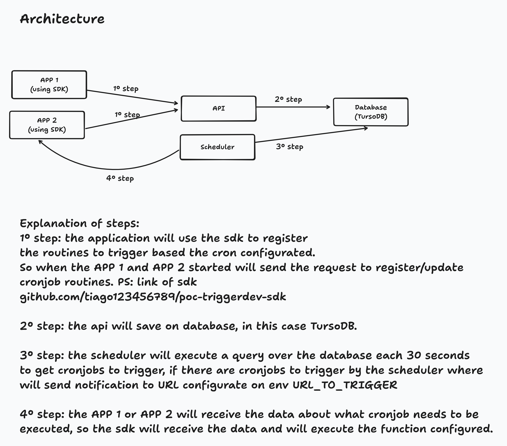

## 🚀 About This Project

This project is a personal challenge to build a solution inspired by [Trigger.dev](https://trigger.dev) — an SDK-based system that allows developers to schedule and run tasks using cron expressions, **without** relying on traditional cron job libraries.

What makes this solution different?  
It's designed specifically for **serverless containers**, such as **Google Cloud Run**, where applications scale to zero when idle. This creates a challenge: cron jobs can’t run if the application isn’t active.

### 🔧 My Approach

Here’s how this project solves the problem:

- Your application exposes a specific HTTP endpoint.
- A scheduler service sends a request to this endpoint whenever a cron job is due.
- Serverless platforms like Cloud Run will automatically "wake up" your application to handle the request.
- A custom-built SDK handles the request and executes the registered function accordingly.

## TECHNOLOGIES:

### API

- Golang
- Fiber
- TursoDB(database)

### SDK

- Golang

## INSTRUCTIONS TO RUN THE API

- Clone
- Create file .env with the envs:

```txt

TURSO_DATABASE_URL="" // Create account on Turso DB to get that data
TURSO_AUTH_TOKEN=""  // Create account on Turso DB to get that data
```

- Execute command **go run cmd/api/main.go** to start the api. PS: if you starting the application first time, will download the packages and after will create the tables in TursoDB.
- Execute command **go run cmd/scheduler/main.go** to start the scheduler responsible to notify cronjob if needs to trigger.

## INSTRUCTIONS TO USE THE SDK ON YOUR API

- Access your project
- Execute the command **go get github.com/tiago123456789/poc-triggerdev-sdk@v1.0.0** to download the sdk to register the cronjob tasks.
- Set the following envs:

```txt
REMOTE_TRIGGER_ENDPOINT="address_from_api_path_cron" // For example: http://localhost:3000/crons
REMOTE_TRIGGER_LOGGERS_ENDPOINT="address_from_api_path_cron" // For example: http://localhost:3000/crons-logs
URL_TO_TRIGGER="address_from_your_application_scheduler_notify" // For example: http://localhost:3002/crons
```

- Example using the SDK:

```golang

package main

import (
	"fmt"
	"log"
	"log/slog"

	"github.com/gofiber/fiber/v2"
	"github.com/joho/godotenv"
	"github.com/tiago123456789/poc-triggerdev-sdk/task"
)

func main() {
	err := godotenv.Load()
	if err != nil {
		log.Fatal("Error loading .env file")
	}

	taskScheduled := task.Init()

	taskScheduled.Add(task.TaskScheduled{
		Id:   "hellov2",
		Name: "Say hello",
		Cron: "*/1 * * * *",
		Action: func(message map[string]interface{}, logger *slog.Logger) error {
			logger.Info("Executing code")
			fmt.Println("Hi my friend v2!!!")
			return nil
		},
	})

	taskScheduled.Add(task.TaskScheduled{
		Id:   "hi-testv2",
		Name: "hi-test",
		Cron: "*/1 * * * *",
		Action: func(message map[string]interface{}, logger *slog.Logger) error {
			logger.Info("Executing code")
			fmt.Println("hi-test v2")
			return nil
		},
	})

	taskScheduled.Start()

	app := fiber.New()

	app.Post("/crons", func(c *fiber.Ctx) error {
		var data task.TaskScheduledToRegister
		c.BodyParser(&data)

		go taskScheduled.Execute(data.Id, map[string]interface{}{})
		return c.SendString("OK")
	})

	app.Listen(":3002")
}
```

- Now you need to start your application, so the sdk will save the cronjob tasks data in api and the scheduler will start to notify the cronjobs needs to be executed.

## ARCHITECTURE


